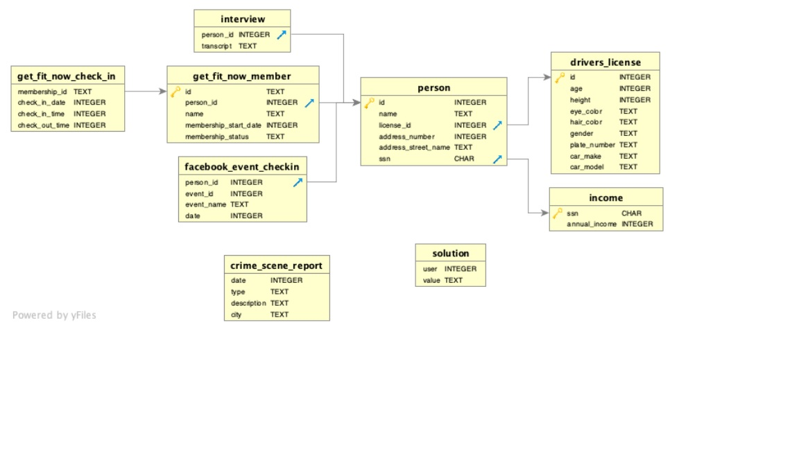

# Murder in SQL City

#### About this project

> I am a detective and there's been a Murder in SQL City!
> My partner gave me the crime scene report, but I somehow lost it. I vaguely remember that the crime was a murder that occurred sometime on Jan. 15, 2018, and that it took place in SQL City.
> My job is to find the murderer.

#### Background

> The idea for this project comes from UDACITY.
> The SQL Murder Mystery was created by Joon Park and Cathy He while they were Knight Lab fellows. See the GitHub repository for more information.
> Original code for this project is released under the MIT License
> Original text and other content for this project is released under Creative Commons CC BY-SA 4.0
> This mystery was inspired by a crime in the neighbouring Terminal City.

#### Skills I will use

> - SQL query to retrieve data from database.

### Schema diagram



## PART 1 - Crime Scene Report

- The first thing to do is query the crime scene report database.
  I have to look for murders that happened in SQL City, and we know the crime happened on 2018-01-15.

- I have found the report:  
  Security footage shows that there were 2 witnesses. The first witness lives at the last house on "Northwestern Dr". The second witness, named Annabel, lives somewhere on "Franklin Ave".

```sql
SELECT *
FROM   crime_scene_report
WHERE  type = 'murder'
       AND city = 'SQL City'
       AND date = '20180115';
```

## PART 2 - Witnesses

We got some information about the 2 witnesses. Based on this information, I am going to find more details about them from the person table.

```sql
SELECT *
FROM   person
WHERE  address_street_name = 'Northwestern Dr'
       AND address_number = (SELECT Max(address_number)
                             FROM   person
                             WHERE  address_street_name = 'Northwestern Dr');
```
> id    name           license_id address_number address_street_name ssn  
> 14887 Morty Schapiro 118009     4919           Northwestern Dr     111564949

```sql
SELECT *
FROM   person
WHERE  NAME LIKE 'Annabel%'
       AND address_street_name = 'Franklin Ave';
```

> id    name           license_id address_number address_street_name ssn  
> 16371 Annabel Miller 490173     103            Franklin Ave        318771143

So, I got all information about the witnesses, let's interview them.

## PART 3 - Interview

- I will use the interview table to get information about the murderer.

```sql
SELECT *
FROM interview
WHERE person_id = 14887
```

> I heard a gunshot and then saw a man run out. He had a "Get Fit Now Gym" bag. The membership number on the bag started with "48Z". Only gold members have those bags. The man got into a car with a plate that included "H42W".

```sql
SELECT *
FROM interview
WHERE person_id = 16371
```

> I saw the murder happen, and I recognized the killer from my gym when I was working out last week on January the 9th.

I got information about the murderer. Let's catch him!

## PART 4 - Get The murderer

- I will create a view and join tables to get the results.

```sql
DROP VIEW IF EXISTS person_info;

CREATE VIEW person_info
AS
  SELECT membership_id,
         check_in_date,
         check_in_time,
         check_out_time,
         get_fit_now_member.name AS member,
         membership_start_date,
         membership_status,
         person.name             AS person,
         address_number,
         address_street_name,
         age,
         height,
         eye_color,
         hair_color,
         gender,
         plate_number,
         car_make,
         car_model,
         annual_income,
         event_name              AS facebook_event,
         DATE                    AS facebook_event_date,
		     transcript
  FROM   get_fit_now_check_in
         JOIN get_fit_now_member
           ON get_fit_now_check_in.membership_id = get_fit_now_member.id
         JOIN person
           ON get_fit_now_member.person_id = person.id
         JOIN facebook_event_checkin
           ON facebook_event_checkin.person_id = person.id
         JOIN drivers_license
           ON drivers_license.id = person.license_id
         JOIN income
           ON person.ssn = income.ssn
		 JOIN interview
		   ON interview.person_id = person.id;

SELECT DISTINCT member,
	   transcript
FROM   person_info
WHERE  membership_id LIKE '48Z%'
       AND membership_status = 'gold'
       AND plate_number LIKE '%H42W%'
       AND check_in_date LIKE '%0109'
```

- Murderer name : Jeremy Bowers

- I did interview him. 

> I was hired by a woman with a lot of money. I don't know her name but I know she's around 5'5" (65") or 5'7" (67"). She has red hair and she drives a Tesla Model S. I know that she attended the SQL Symphony Concert 3 times in December 2017.

## PART 5 - ENDGAME

- I have found out, the murderer was hired by a woman. Let's catch her!

```sql
SELECT
	DISTINCT name,
	address_number,
	address_street_name,
	event_name,
	COUNT(event_name) AS Number_of_events
FROM person
JOIN drivers_license
	ON person.license_id = drivers_license.id
JOIN facebook_event_checkin
	ON person.id = facebook_event_checkin.person_id
WHERE
	car_make = 'Tesla'
	AND car_model = 'Model S'
	AND height BETWEEN 65 AND 67
	AND gender = 'female'
	AND hair_color = 'red'
	AND event_name = 'SQL Symphony Concert'
```

> name             address_number address_street_name event_name            Number_of_events  
> Miranda Priestly 1883           Golden Ave          SQL Symphony Concert  3

#### I put these 2 people in prison.
#### SQL City is happy again! 
